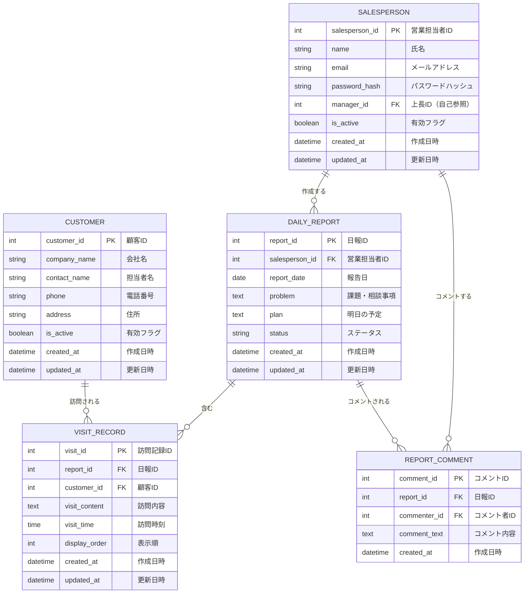

# 営業日報システム ER図・テーブル定義書

## 1. ER図



---

## 2. テーブル一覧

| No | テーブル名 | 論理名 | 説明 |
|----|-----------|--------|------|
| 1 | SALESPERSON | 営業担当者 | 営業担当者マスタ。上長も同テーブルで管理 |
| 2 | CUSTOMER | 顧客 | 顧客マスタ |
| 3 | DAILY_REPORT | 日報 | 日報。営業担当者ごと・日付ごとに1レコード |
| 4 | VISIT_RECORD | 訪問記録 | 訪問記録。1日報に複数の訪問記録を紐付け |
| 5 | REPORT_COMMENT | 日報コメント | 日報へのコメント。複数コメント可能 |

---

## 3. テーブル定義詳細

### 3.1 SALESPERSON（営業担当者）

営業担当者のマスタテーブル。上長も同一テーブルで管理し、`manager_id`で階層構造を表現する。

| No | カラム名 | 論理名 | データ型 | PK | FK | NOT NULL | デフォルト | 説明 |
|----|----------|--------|----------|----|----|----------|-----------|------|
| 1 | salesperson_id | 営業担当者ID | INT | ○ | | ○ | AUTO_INCREMENT | 主キー |
| 2 | name | 氏名 | VARCHAR(100) | | | ○ | | 営業担当者の氏名 |
| 3 | email | メールアドレス | VARCHAR(255) | | | ○ | | ログインID、ユニーク制約 |
| 4 | password_hash | パスワードハッシュ | VARCHAR(255) | | | ○ | | ハッシュ化されたパスワード |
| 5 | manager_id | 上長ID | INT | | ○ | | NULL | 自己参照、NULLは最上位者 |
| 6 | is_active | 有効フラグ | BOOLEAN | | | ○ | TRUE | 論理削除用 |
| 7 | created_at | 作成日時 | DATETIME | | | ○ | CURRENT_TIMESTAMP | レコード作成日時 |
| 8 | updated_at | 更新日時 | DATETIME | | | ○ | CURRENT_TIMESTAMP | レコード更新日時 |

**インデックス**
| インデックス名 | カラム | 種類 |
|---------------|--------|------|
| PK_SALESPERSON | salesperson_id | PRIMARY KEY |
| UK_SALESPERSON_EMAIL | email | UNIQUE |
| IX_SALESPERSON_MANAGER | manager_id | INDEX |

**外部キー**
| 制約名 | カラム | 参照テーブル | 参照カラム |
|--------|--------|-------------|-----------|
| FK_SALESPERSON_MANAGER | manager_id | SALESPERSON | salesperson_id |

---

### 3.2 CUSTOMER（顧客）

顧客のマスタテーブル。

| No | カラム名 | 論理名 | データ型 | PK | FK | NOT NULL | デフォルト | 説明 |
|----|----------|--------|----------|----|----|----------|-----------|------|
| 1 | customer_id | 顧客ID | INT | ○ | | ○ | AUTO_INCREMENT | 主キー |
| 2 | company_name | 会社名 | VARCHAR(200) | | | ○ | | 顧客の会社名 |
| 3 | contact_name | 担当者名 | VARCHAR(100) | | | | NULL | 顧客側の担当者名 |
| 4 | phone | 電話番号 | VARCHAR(20) | | | | NULL | ハイフン含む形式可 |
| 5 | address | 住所 | VARCHAR(500) | | | | NULL | 所在地 |
| 6 | is_active | 有効フラグ | BOOLEAN | | | ○ | TRUE | 論理削除用 |
| 7 | created_at | 作成日時 | DATETIME | | | ○ | CURRENT_TIMESTAMP | レコード作成日時 |
| 8 | updated_at | 更新日時 | DATETIME | | | ○ | CURRENT_TIMESTAMP | レコード更新日時 |

**インデックス**
| インデックス名 | カラム | 種類 |
|---------------|--------|------|
| PK_CUSTOMER | customer_id | PRIMARY KEY |
| IX_CUSTOMER_COMPANY_NAME | company_name | INDEX |
| IX_CUSTOMER_IS_ACTIVE | is_active | INDEX |

---

### 3.3 DAILY_REPORT（日報）

日報テーブル。営業担当者ごと・日付ごとに1レコードを持つ。

| No | カラム名 | 論理名 | データ型 | PK | FK | NOT NULL | デフォルト | 説明 |
|----|----------|--------|----------|----|----|----------|-----------|------|
| 1 | report_id | 日報ID | INT | ○ | | ○ | AUTO_INCREMENT | 主キー |
| 2 | salesperson_id | 営業担当者ID | INT | | ○ | ○ | | 日報作成者 |
| 3 | report_date | 報告日 | DATE | | | ○ | | 日報の対象日 |
| 4 | problem | 課題・相談事項 | TEXT | | | | NULL | Problem（最大4000文字） |
| 5 | plan | 明日の予定 | TEXT | | | | NULL | Plan（最大4000文字） |
| 6 | status | ステータス | VARCHAR(20) | | | ○ | 'draft' | draft/submitted/confirmed |
| 7 | created_at | 作成日時 | DATETIME | | | ○ | CURRENT_TIMESTAMP | レコード作成日時 |
| 8 | updated_at | 更新日時 | DATETIME | | | ○ | CURRENT_TIMESTAMP | レコード更新日時 |

**インデックス**
| インデックス名 | カラム | 種類 |
|---------------|--------|------|
| PK_DAILY_REPORT | report_id | PRIMARY KEY |
| UK_DAILY_REPORT_DATE | salesperson_id, report_date | UNIQUE |
| IX_DAILY_REPORT_DATE | report_date | INDEX |
| IX_DAILY_REPORT_STATUS | status | INDEX |

**外部キー**
| 制約名 | カラム | 参照テーブル | 参照カラム |
|--------|--------|-------------|-----------|
| FK_DAILY_REPORT_SALESPERSON | salesperson_id | SALESPERSON | salesperson_id |

**ステータス値**
| 値 | 論理名 | 説明 |
|----|--------|------|
| draft | 下書き | 編集可能、削除可能 |
| submitted | 提出済 | 編集不可、上長確認待ち |
| confirmed | 確認済 | 上長が確認完了 |

---

### 3.4 VISIT_RECORD（訪問記録）

日報に紐づく訪問記録テーブル。1日報に対して複数の訪問記録を登録可能。

| No | カラム名 | 論理名 | データ型 | PK | FK | NOT NULL | デフォルト | 説明 |
|----|----------|--------|----------|----|----|----------|-----------|------|
| 1 | visit_id | 訪問記録ID | INT | ○ | | ○ | AUTO_INCREMENT | 主キー |
| 2 | report_id | 日報ID | INT | | ○ | ○ | | 紐づく日報 |
| 3 | customer_id | 顧客ID | INT | | ○ | ○ | | 訪問先顧客 |
| 4 | visit_content | 訪問内容 | TEXT | | | ○ | | 活動内容（最大2000文字） |
| 5 | visit_time | 訪問時刻 | TIME | | | | NULL | 訪問した時刻 |
| 6 | display_order | 表示順 | INT | | | ○ | 0 | 表示順序 |
| 7 | created_at | 作成日時 | DATETIME | | | ○ | CURRENT_TIMESTAMP | レコード作成日時 |
| 8 | updated_at | 更新日時 | DATETIME | | | ○ | CURRENT_TIMESTAMP | レコード更新日時 |

**インデックス**
| インデックス名 | カラム | 種類 |
|---------------|--------|------|
| PK_VISIT_RECORD | visit_id | PRIMARY KEY |
| IX_VISIT_RECORD_REPORT | report_id | INDEX |
| IX_VISIT_RECORD_CUSTOMER | customer_id | INDEX |

**外部キー**
| 制約名 | カラム | 参照テーブル | 参照カラム | ON DELETE |
|--------|--------|-------------|-----------|-----------|
| FK_VISIT_RECORD_REPORT | report_id | DAILY_REPORT | report_id | CASCADE |
| FK_VISIT_RECORD_CUSTOMER | customer_id | CUSTOMER | customer_id | RESTRICT |

---

### 3.5 REPORT_COMMENT（日報コメント）

日報に対するコメントテーブル。上長や本人が複数コメントを投稿可能。

| No | カラム名 | 論理名 | データ型 | PK | FK | NOT NULL | デフォルト | 説明 |
|----|----------|--------|----------|----|----|----------|-----------|------|
| 1 | comment_id | コメントID | INT | ○ | | ○ | AUTO_INCREMENT | 主キー |
| 2 | report_id | 日報ID | INT | | ○ | ○ | | 紐づく日報 |
| 3 | commenter_id | コメント者ID | INT | | ○ | ○ | | コメント投稿者 |
| 4 | comment_text | コメント内容 | TEXT | | | ○ | | コメント本文（最大2000文字） |
| 5 | created_at | 作成日時 | DATETIME | | | ○ | CURRENT_TIMESTAMP | コメント投稿日時 |

**インデックス**
| インデックス名 | カラム | 種類 |
|---------------|--------|------|
| PK_REPORT_COMMENT | comment_id | PRIMARY KEY |
| IX_REPORT_COMMENT_REPORT | report_id | INDEX |
| IX_REPORT_COMMENT_COMMENTER | commenter_id | INDEX |
| IX_REPORT_COMMENT_CREATED | created_at | INDEX |

**外部キー**
| 制約名 | カラム | 参照テーブル | 参照カラム | ON DELETE |
|--------|--------|-------------|-----------|-----------|
| FK_REPORT_COMMENT_REPORT | report_id | DAILY_REPORT | report_id | CASCADE |
| FK_REPORT_COMMENT_COMMENTER | commenter_id | SALESPERSON | salesperson_id | RESTRICT |

---

## 4. リレーションシップ一覧

| No | 親テーブル | 子テーブル | カーディナリティ | 説明 |
|----|-----------|-----------|-----------------|------|
| 1 | SALESPERSON | SALESPERSON | 1:N | 上長と部下の関係（自己参照） |
| 2 | SALESPERSON | DAILY_REPORT | 1:N | 営業担当者が日報を作成 |
| 3 | SALESPERSON | REPORT_COMMENT | 1:N | 営業担当者がコメントを投稿 |
| 4 | CUSTOMER | VISIT_RECORD | 1:N | 顧客への訪問記録 |
| 5 | DAILY_REPORT | VISIT_RECORD | 1:N | 日報に複数の訪問記録 |
| 6 | DAILY_REPORT | REPORT_COMMENT | 1:N | 日報に複数のコメント |

---

## 5. DDL（MySQL）

```sql
-- 営業担当者テーブル
CREATE TABLE SALESPERSON (
    salesperson_id INT AUTO_INCREMENT PRIMARY KEY,
    name VARCHAR(100) NOT NULL,
    email VARCHAR(255) NOT NULL,
    password_hash VARCHAR(255) NOT NULL,
    manager_id INT NULL,
    is_active BOOLEAN NOT NULL DEFAULT TRUE,
    created_at DATETIME NOT NULL DEFAULT CURRENT_TIMESTAMP,
    updated_at DATETIME NOT NULL DEFAULT CURRENT_TIMESTAMP ON UPDATE CURRENT_TIMESTAMP,
    UNIQUE KEY UK_SALESPERSON_EMAIL (email),
    KEY IX_SALESPERSON_MANAGER (manager_id),
    CONSTRAINT FK_SALESPERSON_MANAGER FOREIGN KEY (manager_id) REFERENCES SALESPERSON(salesperson_id)
) ENGINE=InnoDB DEFAULT CHARSET=utf8mb4 COLLATE=utf8mb4_unicode_ci;

-- 顧客テーブル
CREATE TABLE CUSTOMER (
    customer_id INT AUTO_INCREMENT PRIMARY KEY,
    company_name VARCHAR(200) NOT NULL,
    contact_name VARCHAR(100) NULL,
    phone VARCHAR(20) NULL,
    address VARCHAR(500) NULL,
    is_active BOOLEAN NOT NULL DEFAULT TRUE,
    created_at DATETIME NOT NULL DEFAULT CURRENT_TIMESTAMP,
    updated_at DATETIME NOT NULL DEFAULT CURRENT_TIMESTAMP ON UPDATE CURRENT_TIMESTAMP,
    KEY IX_CUSTOMER_COMPANY_NAME (company_name),
    KEY IX_CUSTOMER_IS_ACTIVE (is_active)
) ENGINE=InnoDB DEFAULT CHARSET=utf8mb4 COLLATE=utf8mb4_unicode_ci;

-- 日報テーブル
CREATE TABLE DAILY_REPORT (
    report_id INT AUTO_INCREMENT PRIMARY KEY,
    salesperson_id INT NOT NULL,
    report_date DATE NOT NULL,
    problem TEXT NULL,
    plan TEXT NULL,
    status VARCHAR(20) NOT NULL DEFAULT 'draft',
    created_at DATETIME NOT NULL DEFAULT CURRENT_TIMESTAMP,
    updated_at DATETIME NOT NULL DEFAULT CURRENT_TIMESTAMP ON UPDATE CURRENT_TIMESTAMP,
    UNIQUE KEY UK_DAILY_REPORT_DATE (salesperson_id, report_date),
    KEY IX_DAILY_REPORT_DATE (report_date),
    KEY IX_DAILY_REPORT_STATUS (status),
    CONSTRAINT FK_DAILY_REPORT_SALESPERSON FOREIGN KEY (salesperson_id) REFERENCES SALESPERSON(salesperson_id)
) ENGINE=InnoDB DEFAULT CHARSET=utf8mb4 COLLATE=utf8mb4_unicode_ci;

-- 訪問記録テーブル
CREATE TABLE VISIT_RECORD (
    visit_id INT AUTO_INCREMENT PRIMARY KEY,
    report_id INT NOT NULL,
    customer_id INT NOT NULL,
    visit_content TEXT NOT NULL,
    visit_time TIME NULL,
    display_order INT NOT NULL DEFAULT 0,
    created_at DATETIME NOT NULL DEFAULT CURRENT_TIMESTAMP,
    updated_at DATETIME NOT NULL DEFAULT CURRENT_TIMESTAMP ON UPDATE CURRENT_TIMESTAMP,
    KEY IX_VISIT_RECORD_REPORT (report_id),
    KEY IX_VISIT_RECORD_CUSTOMER (customer_id),
    CONSTRAINT FK_VISIT_RECORD_REPORT FOREIGN KEY (report_id) REFERENCES DAILY_REPORT(report_id) ON DELETE CASCADE,
    CONSTRAINT FK_VISIT_RECORD_CUSTOMER FOREIGN KEY (customer_id) REFERENCES CUSTOMER(customer_id)
) ENGINE=InnoDB DEFAULT CHARSET=utf8mb4 COLLATE=utf8mb4_unicode_ci;

-- 日報コメントテーブル
CREATE TABLE REPORT_COMMENT (
    comment_id INT AUTO_INCREMENT PRIMARY KEY,
    report_id INT NOT NULL,
    commenter_id INT NOT NULL,
    comment_text TEXT NOT NULL,
    created_at DATETIME NOT NULL DEFAULT CURRENT_TIMESTAMP,
    KEY IX_REPORT_COMMENT_REPORT (report_id),
    KEY IX_REPORT_COMMENT_COMMENTER (commenter_id),
    KEY IX_REPORT_COMMENT_CREATED (created_at),
    CONSTRAINT FK_REPORT_COMMENT_REPORT FOREIGN KEY (report_id) REFERENCES DAILY_REPORT(report_id) ON DELETE CASCADE,
    CONSTRAINT FK_REPORT_COMMENT_COMMENTER FOREIGN KEY (commenter_id) REFERENCES SALESPERSON(salesperson_id)
) ENGINE=InnoDB DEFAULT CHARSET=utf8mb4 COLLATE=utf8mb4_unicode_ci;
```

---

## 6. 補足事項

### 6.1 論理削除について
- `SALESPERSON`と`CUSTOMER`テーブルは`is_active`フラグによる論理削除を採用
- 物理削除は行わず、無効化することで履歴を保持

### 6.2 日報の一意制約
- 同一営業担当者が同じ日付の日報を複数作成することはできない
- `UK_DAILY_REPORT_DATE (salesperson_id, report_date)` で制御

### 6.3 カスケード削除
- 日報を削除すると、紐づく訪問記録とコメントも自動削除される
- 顧客・営業担当者は参照がある場合は削除不可（RESTRICT）

### 6.4 文字コード
- UTF-8（utf8mb4）を使用し、絵文字等の4バイト文字に対応
