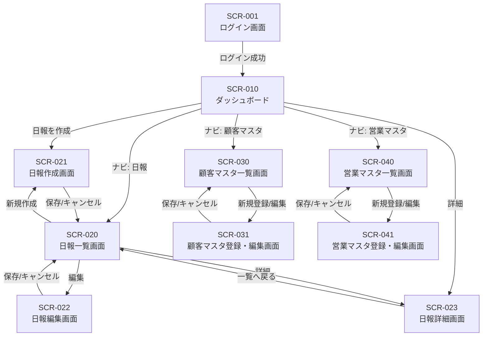

# 営業日報システム 画面定義書

## 1. 画面一覧

| No | 画面ID | 画面名 | 概要 |
|----|--------|--------|------|
| 1 | SCR-001 | ログイン画面 | システムへのログイン |
| 2 | SCR-010 | ダッシュボード | ホーム画面、日報一覧・ステータス確認 |
| 3 | SCR-020 | 日報一覧画面 | 日報の検索・一覧表示 |
| 4 | SCR-021 | 日報作成画面 | 新規日報の作成 |
| 5 | SCR-022 | 日報編集画面 | 既存日報の編集 |
| 6 | SCR-023 | 日報詳細画面 | 日報の詳細表示・コメント機能 |
| 7 | SCR-030 | 顧客マスタ一覧画面 | 顧客マスタの検索・一覧表示 |
| 8 | SCR-031 | 顧客マスタ登録・編集画面 | 顧客情報の登録・編集 |
| 9 | SCR-040 | 営業担当者マスタ一覧画面 | 営業担当者の検索・一覧表示 |
| 10 | SCR-041 | 営業担当者マスタ登録・編集画面 | 営業担当者情報の登録・編集 |

---

## 2. 画面詳細定義

---

### SCR-001: ログイン画面

#### 画面概要
システムにログインするための認証画面

#### 画面レイアウト
```
┌─────────────────────────────────────────────────────┐
│                                                     │
│              営業日報システム                         │
│                                                     │
│         ┌─────────────────────────┐                 │
│         │ メールアドレス            │                 │
│         └─────────────────────────┘                 │
│         ┌─────────────────────────┐                 │
│         │ パスワード               │                 │
│         └─────────────────────────┘                 │
│                                                     │
│              [ ログイン ]                            │
│                                                     │
└─────────────────────────────────────────────────────┘
```

#### 入力項目

| No | 項目ID | 項目名 | 種別 | 必須 | 桁数 | 備考 |
|----|--------|--------|------|------|------|------|
| 1 | email | メールアドレス | テキスト | ○ | 255 | メール形式チェック |
| 2 | password | パスワード | パスワード | ○ | 100 | マスク表示 |

#### ボタン

| No | ボタンID | ボタン名 | 処理内容 |
|----|----------|----------|----------|
| 1 | btn_login | ログイン | 認証処理を実行し、成功時はダッシュボードへ遷移 |

#### 画面遷移
- ログイン成功 → SCR-010（ダッシュボード）

---

### SCR-010: ダッシュボード

#### 画面概要
ログイン後のホーム画面。本日の日報ステータスや最近の日報一覧を表示

#### 画面レイアウト
```
┌─────────────────────────────────────────────────────────────────┐
│ [ロゴ]  営業日報システム          [ユーザー名 ▼] [ログアウト]     │
├─────────────────────────────────────────────────────────────────┤
│ ナビゲーション: [日報] [顧客マスタ] [営業マスタ]                   │
├─────────────────────────────────────────────────────────────────┤
│                                                                 │
│  ┌─────────────────┐  ┌─────────────────┐                       │
│  │ 本日の日報       │  │ 未確認コメント   │                       │
│  │ ステータス: 未作成│  │ 3件              │                       │
│  │ [日報を作成]     │  │ [確認する]       │                       │
│  └─────────────────┘  └─────────────────┘                       │
│                                                                 │
│  最近の日報                                                      │
│  ┌───────────────────────────────────────────────────────────┐  │
│  │ 日付       │ ステータス │ 訪問件数 │ コメント │ 操作       │  │
│  ├───────────────────────────────────────────────────────────┤  │
│  │ 2026/01/10 │ 確認済    │ 5件      │ 2件     │ [詳細]     │  │
│  │ 2026/01/09 │ 提出済    │ 3件      │ 0件     │ [詳細]     │  │
│  │ 2026/01/08 │ 確認済    │ 4件      │ 1件     │ [詳細]     │  │
│  └───────────────────────────────────────────────────────────┘  │
│                                                                 │
└─────────────────────────────────────────────────────────────────┘
```

#### 表示項目

| No | 項目ID | 項目名 | 種別 | 備考 |
|----|--------|--------|------|------|
| 1 | today_status | 本日の日報ステータス | ラベル | 未作成/下書き/提出済/確認済 |
| 2 | unread_comments | 未確認コメント数 | ラベル | 新着コメント件数 |
| 3 | recent_reports | 最近の日報一覧 | テーブル | 直近7日分を表示 |

#### ボタン

| No | ボタンID | ボタン名 | 処理内容 |
|----|----------|----------|----------|
| 1 | btn_create_report | 日報を作成 | 本日の日報作成画面へ遷移 |
| 2 | btn_check_comments | 確認する | 未確認コメントがある日報詳細へ遷移 |
| 3 | btn_detail | 詳細 | 該当日報の詳細画面へ遷移 |

#### 画面遷移
- 日報を作成 → SCR-021（日報作成画面）
- 詳細 → SCR-023（日報詳細画面）

---

### SCR-020: 日報一覧画面

#### 画面概要
日報の検索・一覧表示画面。上長は部下の日報も閲覧可能

#### 画面レイアウト
```
┌─────────────────────────────────────────────────────────────────┐
│ [ロゴ]  営業日報システム          [ユーザー名 ▼] [ログアウト]     │
├─────────────────────────────────────────────────────────────────┤
│ ナビゲーション: [日報] [顧客マスタ] [営業マスタ]                   │
├─────────────────────────────────────────────────────────────────┤
│                                                                 │
│  日報一覧                                      [ + 新規作成 ]    │
│                                                                 │
│  検索条件                                                        │
│  ┌───────────────────────────────────────────────────────────┐  │
│  │ 期間: [2026/01/01] ～ [2026/01/11]                        │  │
│  │ 担当者: [全員 ▼]  ステータス: [全て ▼]                     │  │
│  │                                    [検索] [クリア]         │  │
│  └───────────────────────────────────────────────────────────┘  │
│                                                                 │
│  検索結果: 25件                                                  │
│  ┌───────────────────────────────────────────────────────────┐  │
│  │ 日付       │ 担当者   │ ステータス │ 訪問件数 │ 操作       │  │
│  ├───────────────────────────────────────────────────────────┤  │
│  │ 2026/01/11 │ 山田太郎 │ 下書き    │ 2件      │ [編集][詳細]│  │
│  │ 2026/01/10 │ 山田太郎 │ 確認済    │ 5件      │ [詳細]     │  │
│  │ 2026/01/10 │ 鈴木花子 │ 提出済    │ 3件      │ [詳細]     │  │
│  └───────────────────────────────────────────────────────────┘  │
│                                                                 │
│  [< 前へ] 1 2 3 4 5 [次へ >]                                     │
│                                                                 │
└─────────────────────────────────────────────────────────────────┘
```

#### 検索条件

| No | 項目ID | 項目名 | 種別 | 必須 | 備考 |
|----|--------|--------|------|------|------|
| 1 | date_from | 期間（開始） | 日付 | - | カレンダー選択 |
| 2 | date_to | 期間（終了） | 日付 | - | カレンダー選択 |
| 3 | salesperson_id | 担当者 | セレクト | - | 上長のみ部下を選択可能 |
| 4 | status | ステータス | セレクト | - | 全て/下書き/提出済/確認済 |

#### 一覧表示項目

| No | 項目ID | 項目名 | 備考 |
|----|--------|--------|------|
| 1 | report_date | 日付 | YYYY/MM/DD形式 |
| 2 | salesperson_name | 担当者 | 営業担当者名 |
| 3 | status | ステータス | 下書き/提出済/確認済 |
| 4 | visit_count | 訪問件数 | 訪問記録の件数 |

#### ボタン

| No | ボタンID | ボタン名 | 処理内容 |
|----|----------|----------|----------|
| 1 | btn_new | 新規作成 | 日報作成画面へ遷移 |
| 2 | btn_search | 検索 | 検索条件で日報を検索 |
| 3 | btn_clear | クリア | 検索条件をクリア |
| 4 | btn_edit | 編集 | 日報編集画面へ遷移（下書きのみ） |
| 5 | btn_detail | 詳細 | 日報詳細画面へ遷移 |

#### 画面遷移
- 新規作成 → SCR-021（日報作成画面）
- 編集 → SCR-022（日報編集画面）
- 詳細 → SCR-023（日報詳細画面）

---

### SCR-021: 日報作成画面

#### 画面概要
新規日報を作成する画面。訪問記録を複数追加可能

#### 画面レイアウト
```
┌─────────────────────────────────────────────────────────────────┐
│ [ロゴ]  営業日報システム          [ユーザー名 ▼] [ログアウト]     │
├─────────────────────────────────────────────────────────────────┤
│ ナビゲーション: [日報] [顧客マスタ] [営業マスタ]                   │
├─────────────────────────────────────────────────────────────────┤
│                                                                 │
│  日報作成                                                        │
│                                                                 │
│  報告日: [2026/01/11]                                           │
│                                                                 │
│  ─────────────────────────────────────────────────────────────  │
│  訪問記録                                        [ + 行追加 ]    │
│  ┌───────────────────────────────────────────────────────────┐  │
│  │ No │ 顧客名           │ 訪問時刻 │ 訪問内容        │ 削除  │  │
│  ├───────────────────────────────────────────────────────────┤  │
│  │ 1  │ [株式会社A ▼]    │ [10:00]  │ [新規提案...]   │ [×]  │  │
│  │ 2  │ [株式会社B ▼]    │ [14:00]  │ [見積提出...]   │ [×]  │  │
│  └───────────────────────────────────────────────────────────┘  │
│                                                                 │
│  ─────────────────────────────────────────────────────────────  │
│  課題・相談事項（Problem）                                        │
│  ┌───────────────────────────────────────────────────────────┐  │
│  │                                                           │  │
│  │ 株式会社Aの案件について、価格交渉が難航しています。         │  │
│  │ 値引き幅についてご相談させてください。                      │  │
│  │                                                           │  │
│  └───────────────────────────────────────────────────────────┘  │
│                                                                 │
│  ─────────────────────────────────────────────────────────────  │
│  明日の予定（Plan）                                              │
│  ┌───────────────────────────────────────────────────────────┐  │
│  │                                                           │  │
│  │ ・株式会社C 初回訪問（10:00）                              │  │
│  │ ・株式会社B フォローアップ電話                             │  │
│  │                                                           │  │
│  └───────────────────────────────────────────────────────────┘  │
│                                                                 │
│            [下書き保存]  [提出]  [キャンセル]                     │
│                                                                 │
└─────────────────────────────────────────────────────────────────┘
```

#### 入力項目

| No | 項目ID | 項目名 | 種別 | 必須 | 桁数 | 備考 |
|----|--------|--------|------|------|------|------|
| 1 | report_date | 報告日 | 日付 | ○ | - | デフォルト: 当日 |

**訪問記録（複数行）**

| No | 項目ID | 項目名 | 種別 | 必須 | 桁数 | 備考 |
|----|--------|--------|------|------|------|------|
| 2 | customer_id | 顧客名 | セレクト | ○ | - | 顧客マスタから選択 |
| 3 | visit_time | 訪問時刻 | 時刻 | - | - | HH:MM形式 |
| 4 | visit_content | 訪問内容 | テキストエリア | ○ | 2000 | 活動内容を記載 |

**その他**

| No | 項目ID | 項目名 | 種別 | 必須 | 桁数 | 備考 |
|----|--------|--------|------|------|------|------|
| 5 | problem | 課題・相談事項 | テキストエリア | - | 4000 | Problem |
| 6 | plan | 明日の予定 | テキストエリア | - | 4000 | Plan |

#### ボタン

| No | ボタンID | ボタン名 | 処理内容 |
|----|----------|----------|----------|
| 1 | btn_add_row | 行追加 | 訪問記録の行を追加 |
| 2 | btn_delete_row | × | 該当行の訪問記録を削除 |
| 3 | btn_draft | 下書き保存 | ステータス「下書き」で保存 |
| 4 | btn_submit | 提出 | ステータス「提出済」で保存 |
| 5 | btn_cancel | キャンセル | 入力内容を破棄して一覧へ戻る |

#### バリデーション
- 訪問記録は最低1件必要（提出時）
- 同じ日付の日報が既に存在する場合はエラー

#### 画面遷移
- 下書き保存 → SCR-020（日報一覧画面）
- 提出 → SCR-020（日報一覧画面）
- キャンセル → SCR-020（日報一覧画面）

---

### SCR-022: 日報編集画面

#### 画面概要
既存の日報を編集する画面。下書きステータスの日報のみ編集可能

#### 画面レイアウト
SCR-021（日報作成画面）と同様

#### 入力項目
SCR-021（日報作成画面）と同様

#### ボタン
SCR-021（日報作成画面）と同様

#### 制約事項
- ステータスが「下書き」の日報のみ編集可能
- 「提出済」「確認済」の日報は編集不可

---

### SCR-023: 日報詳細画面

#### 画面概要
日報の詳細表示とコメント機能を提供する画面

#### 画面レイアウト
```
┌─────────────────────────────────────────────────────────────────┐
│ [ロゴ]  営業日報システム          [ユーザー名 ▼] [ログアウト]     │
├─────────────────────────────────────────────────────────────────┤
│ ナビゲーション: [日報] [顧客マスタ] [営業マスタ]                   │
├─────────────────────────────────────────────────────────────────┤
│                                                                 │
│  日報詳細                                          [一覧へ戻る]  │
│                                                                 │
│  報告日: 2026/01/10    担当者: 山田太郎    ステータス: 提出済     │
│                                                                 │
│  ─────────────────────────────────────────────────────────────  │
│  訪問記録                                                        │
│  ┌───────────────────────────────────────────────────────────┐  │
│  │ No │ 顧客名          │ 訪問時刻 │ 訪問内容                 │  │
│  ├───────────────────────────────────────────────────────────┤  │
│  │ 1  │ 株式会社A       │ 10:00   │ 新規提案を実施。先方は   │  │
│  │    │                 │         │ 前向きに検討中。         │  │
│  │ 2  │ 株式会社B       │ 14:00   │ 見積提出。来週回答予定。 │  │
│  └───────────────────────────────────────────────────────────┘  │
│                                                                 │
│  ─────────────────────────────────────────────────────────────  │
│  課題・相談事項（Problem）                                        │
│  ┌───────────────────────────────────────────────────────────┐  │
│  │ 株式会社Aの案件について、価格交渉が難航しています。         │  │
│  │ 値引き幅についてご相談させてください。                      │  │
│  └───────────────────────────────────────────────────────────┘  │
│                                                                 │
│  ─────────────────────────────────────────────────────────────  │
│  明日の予定（Plan）                                              │
│  ┌───────────────────────────────────────────────────────────┐  │
│  │ ・株式会社C 初回訪問（10:00）                              │  │
│  │ ・株式会社B フォローアップ電話                             │  │
│  └───────────────────────────────────────────────────────────┘  │
│                                                                 │
│  ─────────────────────────────────────────────────────────────  │
│  コメント                                                        │
│  ┌───────────────────────────────────────────────────────────┐  │
│  │ 佐藤課長 (2026/01/10 18:30)                               │  │
│  │ 株式会社Aの件、明日MTGで相談しましょう。                   │  │
│  ├───────────────────────────────────────────────────────────┤  │
│  │ 山田太郎 (2026/01/10 18:45)                               │  │
│  │ 承知しました。資料を準備しておきます。                     │  │
│  └───────────────────────────────────────────────────────────┘  │
│                                                                 │
│  ┌───────────────────────────────────────────────────────────┐  │
│  │ コメントを入力...                                         │  │
│  └───────────────────────────────────────────────────────────┘  │
│                                    [コメント投稿]  [確認済にする] │
│                                                                 │
└─────────────────────────────────────────────────────────────────┘
```

#### 表示項目

| No | 項目ID | 項目名 | 備考 |
|----|--------|--------|------|
| 1 | report_date | 報告日 | YYYY/MM/DD形式 |
| 2 | salesperson_name | 担当者 | 営業担当者名 |
| 3 | status | ステータス | 下書き/提出済/確認済 |
| 4 | visit_records | 訪問記録一覧 | 顧客名、時刻、内容 |
| 5 | problem | 課題・相談事項 | - |
| 6 | plan | 明日の予定 | - |
| 7 | comments | コメント一覧 | 投稿者、日時、内容 |

#### 入力項目

| No | 項目ID | 項目名 | 種別 | 必須 | 桁数 | 備考 |
|----|--------|--------|------|------|------|------|
| 1 | comment_text | コメント | テキストエリア | - | 2000 | 新規コメント入力欄 |

#### ボタン

| No | ボタンID | ボタン名 | 処理内容 | 表示条件 |
|----|----------|----------|----------|----------|
| 1 | btn_back | 一覧へ戻る | 日報一覧画面へ遷移 | 常時 |
| 2 | btn_post_comment | コメント投稿 | コメントを保存 | 常時 |
| 3 | btn_confirm | 確認済にする | ステータスを「確認済」に更新 | 上長のみ、提出済の場合 |

#### 画面遷移
- 一覧へ戻る → SCR-020（日報一覧画面）

---

### SCR-030: 顧客マスタ一覧画面

#### 画面概要
顧客マスタの検索・一覧表示画面

#### 画面レイアウト
```
┌─────────────────────────────────────────────────────────────────┐
│ [ロゴ]  営業日報システム          [ユーザー名 ▼] [ログアウト]     │
├─────────────────────────────────────────────────────────────────┤
│ ナビゲーション: [日報] [顧客マスタ] [営業マスタ]                   │
├─────────────────────────────────────────────────────────────────┤
│                                                                 │
│  顧客マスタ                                      [ + 新規登録 ]  │
│                                                                 │
│  検索条件                                                        │
│  ┌───────────────────────────────────────────────────────────┐  │
│  │ 会社名: [        ]  ステータス: [有効のみ ▼]               │  │
│  │                                    [検索] [クリア]         │  │
│  └───────────────────────────────────────────────────────────┘  │
│                                                                 │
│  検索結果: 50件                                                  │
│  ┌───────────────────────────────────────────────────────────┐  │
│  │ ID  │ 会社名        │ 担当者名   │ 電話番号     │ 操作    │  │
│  ├───────────────────────────────────────────────────────────┤  │
│  │ 001 │ 株式会社A     │ 田中一郎   │ 03-1234-5678│ [編集]  │  │
│  │ 002 │ 株式会社B     │ 山本二郎   │ 03-2345-6789│ [編集]  │  │
│  │ 003 │ 株式会社C     │ 佐々木三郎 │ 03-3456-7890│ [編集]  │  │
│  └───────────────────────────────────────────────────────────┘  │
│                                                                 │
│  [< 前へ] 1 2 3 4 5 [次へ >]                                     │
│                                                                 │
└─────────────────────────────────────────────────────────────────┘
```

#### 検索条件

| No | 項目ID | 項目名 | 種別 | 必須 | 備考 |
|----|--------|--------|------|------|------|
| 1 | company_name | 会社名 | テキスト | - | 部分一致検索 |
| 2 | is_active | ステータス | セレクト | - | 全て/有効のみ/無効のみ |

#### 一覧表示項目

| No | 項目ID | 項目名 | 備考 |
|----|--------|--------|------|
| 1 | customer_id | ID | 顧客ID |
| 2 | company_name | 会社名 | - |
| 3 | contact_name | 担当者名 | - |
| 4 | phone | 電話番号 | - |

#### ボタン

| No | ボタンID | ボタン名 | 処理内容 |
|----|----------|----------|----------|
| 1 | btn_new | 新規登録 | 顧客登録画面へ遷移 |
| 2 | btn_search | 検索 | 検索条件で顧客を検索 |
| 3 | btn_clear | クリア | 検索条件をクリア |
| 4 | btn_edit | 編集 | 顧客編集画面へ遷移 |

#### 画面遷移
- 新規登録 → SCR-031（顧客マスタ登録・編集画面）
- 編集 → SCR-031（顧客マスタ登録・編集画面）

---

### SCR-031: 顧客マスタ登録・編集画面

#### 画面概要
顧客情報の登録・編集画面

#### 画面レイアウト
```
┌─────────────────────────────────────────────────────────────────┐
│ [ロゴ]  営業日報システム          [ユーザー名 ▼] [ログアウト]     │
├─────────────────────────────────────────────────────────────────┤
│ ナビゲーション: [日報] [顧客マスタ] [営業マスタ]                   │
├─────────────────────────────────────────────────────────────────┤
│                                                                 │
│  顧客登録                                                        │
│                                                                 │
│  ┌───────────────────────────────────────────────────────────┐  │
│  │                                                           │  │
│  │  会社名 *      [                              ]           │  │
│  │                                                           │  │
│  │  担当者名      [                              ]           │  │
│  │                                                           │  │
│  │  電話番号      [                              ]           │  │
│  │                                                           │  │
│  │  住所          [                              ]           │  │
│  │                                                           │  │
│  │  ステータス    ○ 有効  ○ 無効                             │  │
│  │                                                           │  │
│  └───────────────────────────────────────────────────────────┘  │
│                                                                 │
│                        [保存]  [キャンセル]                       │
│                                                                 │
└─────────────────────────────────────────────────────────────────┘
```

#### 入力項目

| No | 項目ID | 項目名 | 種別 | 必須 | 桁数 | 備考 |
|----|--------|--------|------|------|------|------|
| 1 | company_name | 会社名 | テキスト | ○ | 200 | - |
| 2 | contact_name | 担当者名 | テキスト | - | 100 | - |
| 3 | phone | 電話番号 | テキスト | - | 20 | ハイフン含む |
| 4 | address | 住所 | テキスト | - | 500 | - |
| 5 | is_active | ステータス | ラジオ | ○ | - | デフォルト: 有効 |

#### ボタン

| No | ボタンID | ボタン名 | 処理内容 |
|----|----------|----------|----------|
| 1 | btn_save | 保存 | 顧客情報を保存 |
| 2 | btn_cancel | キャンセル | 入力を破棄して一覧へ戻る |

#### 画面遷移
- 保存 → SCR-030（顧客マスタ一覧画面）
- キャンセル → SCR-030（顧客マスタ一覧画面）

---

### SCR-040: 営業担当者マスタ一覧画面

#### 画面概要
営業担当者マスタの検索・一覧表示画面

#### 画面レイアウト
```
┌─────────────────────────────────────────────────────────────────┐
│ [ロゴ]  営業日報システム          [ユーザー名 ▼] [ログアウト]     │
├─────────────────────────────────────────────────────────────────┤
│ ナビゲーション: [日報] [顧客マスタ] [営業マスタ]                   │
├─────────────────────────────────────────────────────────────────┤
│                                                                 │
│  営業担当者マスタ                                  [ + 新規登録 ] │
│                                                                 │
│  検索条件                                                        │
│  ┌───────────────────────────────────────────────────────────┐  │
│  │ 氏名: [        ]  ステータス: [有効のみ ▼]                 │  │
│  │                                    [検索] [クリア]         │  │
│  └───────────────────────────────────────────────────────────┘  │
│                                                                 │
│  検索結果: 15件                                                  │
│  ┌───────────────────────────────────────────────────────────┐  │
│  │ ID  │ 氏名       │ メールアドレス      │ 上長     │ 操作  │  │
│  ├───────────────────────────────────────────────────────────┤  │
│  │ 001 │ 佐藤課長   │ sato@example.com   │ -        │ [編集]│  │
│  │ 002 │ 山田太郎   │ yamada@example.com │ 佐藤課長 │ [編集]│  │
│  │ 003 │ 鈴木花子   │ suzuki@example.com │ 佐藤課長 │ [編集]│  │
│  └───────────────────────────────────────────────────────────┘  │
│                                                                 │
│  [< 前へ] 1 2 [次へ >]                                           │
│                                                                 │
└─────────────────────────────────────────────────────────────────┘
```

#### 検索条件

| No | 項目ID | 項目名 | 種別 | 必須 | 備考 |
|----|--------|--------|------|------|------|
| 1 | name | 氏名 | テキスト | - | 部分一致検索 |
| 2 | is_active | ステータス | セレクト | - | 全て/有効のみ/無効のみ |

#### 一覧表示項目

| No | 項目ID | 項目名 | 備考 |
|----|--------|--------|------|
| 1 | salesperson_id | ID | 営業担当者ID |
| 2 | name | 氏名 | - |
| 3 | email | メールアドレス | - |
| 4 | manager_name | 上長 | 上長の氏名 |

#### ボタン

| No | ボタンID | ボタン名 | 処理内容 |
|----|----------|----------|----------|
| 1 | btn_new | 新規登録 | 営業担当者登録画面へ遷移 |
| 2 | btn_search | 検索 | 検索条件で営業担当者を検索 |
| 3 | btn_clear | クリア | 検索条件をクリア |
| 4 | btn_edit | 編集 | 営業担当者編集画面へ遷移 |

#### 画面遷移
- 新規登録 → SCR-041（営業担当者マスタ登録・編集画面）
- 編集 → SCR-041（営業担当者マスタ登録・編集画面）

---

### SCR-041: 営業担当者マスタ登録・編集画面

#### 画面概要
営業担当者情報の登録・編集画面

#### 画面レイアウト
```
┌─────────────────────────────────────────────────────────────────┐
│ [ロゴ]  営業日報システム          [ユーザー名 ▼] [ログアウト]     │
├─────────────────────────────────────────────────────────────────┤
│ ナビゲーション: [日報] [顧客マスタ] [営業マスタ]                   │
├─────────────────────────────────────────────────────────────────┤
│                                                                 │
│  営業担当者登録                                                  │
│                                                                 │
│  ┌───────────────────────────────────────────────────────────┐  │
│  │                                                           │  │
│  │  氏名 *        [                              ]           │  │
│  │                                                           │  │
│  │  メールアドレス * [                           ]           │  │
│  │                                                           │  │
│  │  パスワード *  [                              ]           │  │
│  │  （編集時は空欄で変更なし）                                │  │
│  │                                                           │  │
│  │  上長          [選択してください ▼]                        │  │
│  │                                                           │  │
│  │  ステータス    ○ 有効  ○ 無効                             │  │
│  │                                                           │  │
│  └───────────────────────────────────────────────────────────┘  │
│                                                                 │
│                        [保存]  [キャンセル]                       │
│                                                                 │
└─────────────────────────────────────────────────────────────────┘
```

#### 入力項目

| No | 項目ID | 項目名 | 種別 | 必須 | 桁数 | 備考 |
|----|--------|--------|------|------|------|------|
| 1 | name | 氏名 | テキスト | ○ | 100 | - |
| 2 | email | メールアドレス | テキスト | ○ | 255 | メール形式チェック、重複不可 |
| 3 | password | パスワード | パスワード | ○※ | 100 | ※新規時必須、編集時は任意 |
| 4 | manager_id | 上長 | セレクト | - | - | 営業担当者マスタから選択 |
| 5 | is_active | ステータス | ラジオ | ○ | - | デフォルト: 有効 |

#### ボタン

| No | ボタンID | ボタン名 | 処理内容 |
|----|----------|----------|----------|
| 1 | btn_save | 保存 | 営業担当者情報を保存 |
| 2 | btn_cancel | キャンセル | 入力を破棄して一覧へ戻る |

#### 画面遷移
- 保存 → SCR-040（営業担当者マスタ一覧画面）
- キャンセル → SCR-040（営業担当者マスタ一覧画面）

---

## 3. 画面遷移図



---

## 4. 共通部品

### ヘッダー
- ロゴ
- システム名
- ログインユーザー名（ドロップダウンメニュー）
- ログアウトボタン

### ナビゲーション
- 日報
- 顧客マスタ
- 営業マスタ（管理者権限のみ表示）

### ページネーション
- 前へ / 次へ
- ページ番号表示
- 1ページあたり表示件数: 20件

### メッセージ表示
- 成功メッセージ（緑）
- エラーメッセージ（赤）
- 警告メッセージ（黄）

---

## 5. 権限制御

| 機能 | 一般営業 | 上長 | 管理者 |
|------|----------|------|--------|
| 自分の日報作成・編集 | ○ | ○ | ○ |
| 自分の日報閲覧 | ○ | ○ | ○ |
| 部下の日報閲覧 | × | ○ | ○ |
| 日報へのコメント | ○ | ○ | ○ |
| 日報の確認済み更新 | × | ○ | ○ |
| 顧客マスタ閲覧 | ○ | ○ | ○ |
| 顧客マスタ編集 | × | ○ | ○ |
| 営業担当者マスタ閲覧 | × | × | ○ |
| 営業担当者マスタ編集 | × | × | ○ |
